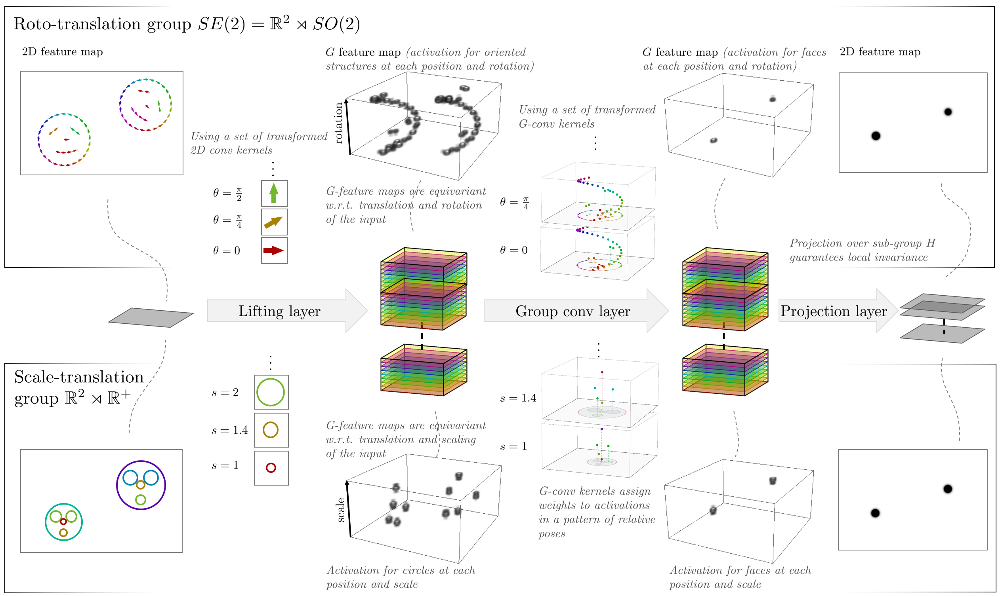

## Spline G-CNNs

This repository contains the source code accompanying the paper "B-Spline CNNs on Lie Groups" which is published ICLR 2020 (https://openreview.net/forum?id=H1gBhkBFDH). The experiments performed in this paper are based on the `gsplinets_tf` library found in this repository. The full set of experiments can be reproduced using the scripts found in the directory `experiments`.



*In G-CNNs feature maps are lifted to the high-dimensional domain of the group G in which features are disentangled with respect to pose/transformation parameters. G-convolution kernels then learn to recognize high-level features in terms of patterns of relative transformations, described by the group structure. This is conceptually illustrated for the detection of faces, which in the SE(2) case are considered as a pattern of lines in relative positions and orientations, or in the scale-translation case as blobs/circles in relative positions and scales. The G-CNNs are equivariant to transformation in G applied to the input; i.e., no information gets lost, it is just shifted to different locations in the network (just as input-translations lead to output translations in standard CNNs).*

## Some notes about the code

The experiments in the paper are build upon the library `gsplinets_tf`. This library is constructed in a modular way keeping future extensions in mind. E.g. only the core group definitions need to be defined in a group class. See e.g. `gsplinets_tf\group` for an implementation of the roto-translation group (`SE2.py`) and the scale-translation group (`R2R+.py`). The layers (lifting convolution: `ConvRdG` and group convolution `ConvGG`) are then automatically constructed in the correct way. See respectively the documentation and demo in the folders `docs` and `demo`.

The code, as it currently is, is not particularly optimized for speed, but rather for flexibility w.r.t. the group classes. The code works by defining an analytic B-spline kernel which are defined by some learnable basis coefficients and which can be sampled on an arbitrary grid. Transformed convolution kernels are then simply obtained by letting a group element act on the grid, and resample the kernel. For each sub-transformation *h* the convolutions are repeated.

*TODO: Speed improvement by considering seperability of the cardinal B-splines, and e.g., pre-blurring followed by (dilated) convolutions (in the case of scale-translation networks).*

*TODO: Generalize to d-dimensional base domains. Currently the code is based on 2D CNNs.* 

## Folder structure
The folder structure is as follows:

* `gsplinets_tf` contains the main tensorflow library.

* `demo` includes some short jupyter notebook demo's on how to use the the code.

* `docs` contains basic documentation of the layer interfaces.

* `experiments` contains the scripts to run the experiments of the ICLR 2020 publication.

## Dependencies

This code as based on tensorflow and has been tested with the following library versions:

* tensorflow-gpu==1.15

* numpy==1.18.1

* scipy==1.3.2

* scikit-learn==0.22.1

* matplotlib==3.1.1

* jupyter==1.0.0

An appropriate environment may be constructed with conda via

```
conda create --yes --name tf
conda activate tf
conda install tensorflow-gpu==1.15 numpy==1.18.1 scipy==1.3.2 scikit-learn==0.22.1 matplotlib==3.1.1 jupyter==1.0.0 --yes
```

## Cite

The development of this library was part of the work done for the paper "B-Spline CNNs on Lie groups" (https://openreview.net/forum?id=H1gBhkBFDH). Please cite this work if you use this code:

```
@inproceedings{
bekkers2020bspline,
title={B-Spline {\{}CNN{\}}s on Lie groups},
author={Erik J Bekkers},
booktitle={International Conference on Learning Representations},
year={2020},
url={https://openreview.net/forum?id=H1gBhkBFDH}
}
```

## License

The code and scripts in this repository are distributed under MIT license. See LICENSE file.
